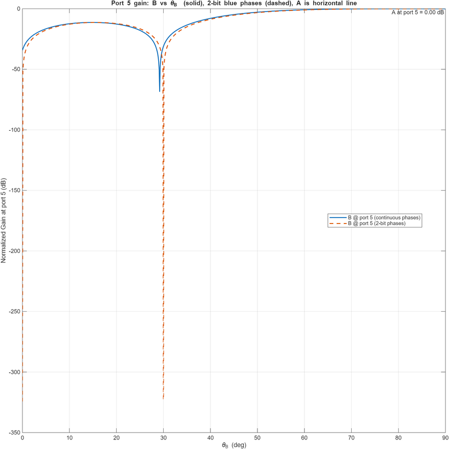
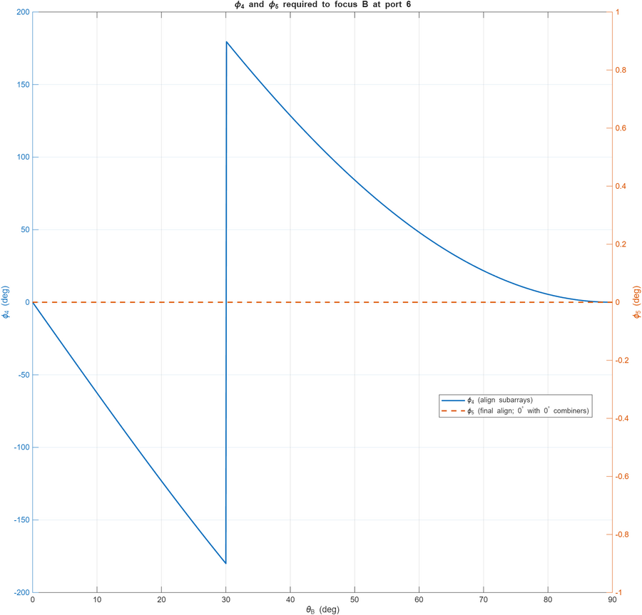
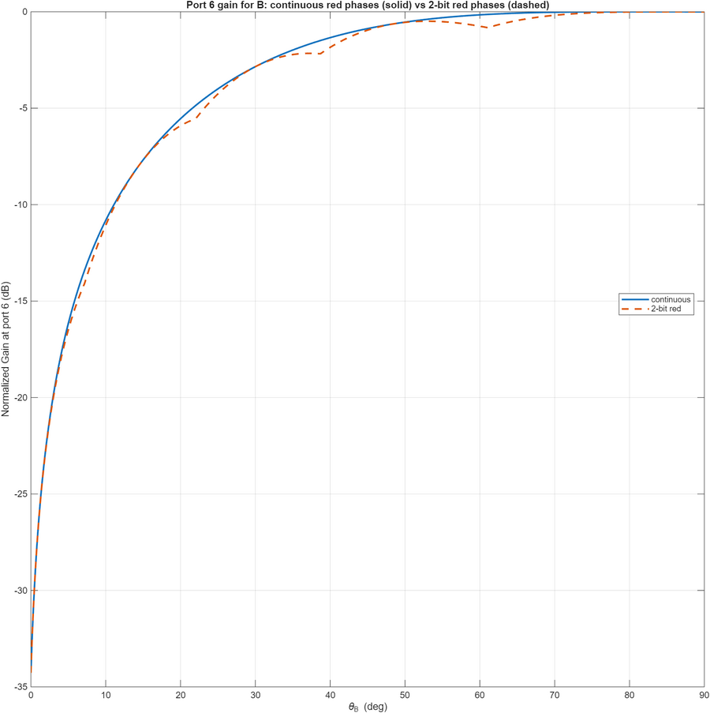
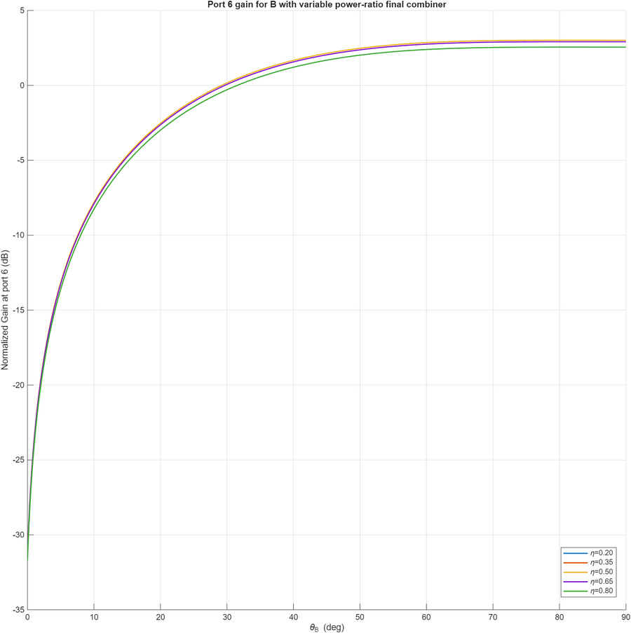

# Beamforming Basics: 4-Element Array with Quantized Phase Shifters

Assignment for Wireless Systems for EE Applications at TU Delft. The task: steer a 4-element receive array so that source A (θ_A = 99°) is delivered to port 5 and source B (swept over θ_B = 0° to 90°) is delivered to port 6, using a two-stage network of 3 dB couplers and phase shifters, then quantify what breaks when the ideal continuous phase shifters are replaced by 2-bit versions (0°, 90°, 180°, 270°).

The full derivations and discussion are in [Beamforming_Basics_5714699.pdf](Beamforming_Basics_5714699.pdf). The MATLAB scripts reproduce every figure.

## What was done

- Derived the blue-network phase settings φ₁, φ₂, φ₃ that focus source A to port 5, using the inter-element phase ψ = π·sin θ.
- Computed the port 5 array response for source B across the full sweep and compared continuous against 2-bit quantized phases.
- Derived the red-network settings: φ₄(θ_B) = arg(S₁₂) − arg(S₃₄) aligns the two sub-array envelopes at the first combiner, and φ₅ = 0° for balanced branches.
- Evaluated the port 6 gain for source B with continuous and 2-bit red phases.
- Replaced the final 3 dB coupler with a variable power-ratio combiner and swept η from 0.20 to 0.80 to test sensitivity to the split ratio.

## Results

Port 5 response: source A sits at 0 dB by construction, while source B is rejected, with a deep null near θ_B ≈ 30°. Quantizing the blue phases to 2 bits shifts the null slightly but barely changes the passband.

Red network control: φ₄ varies smoothly with θ_B except for a 180° wrap near 30°, where the two sub-arrays flip between constructive and destructive combining. φ₅ stays at 0°.

Port 6 gain rises monotonically toward 0 dB as θ_B approaches 90°, the steering direction for B. The 2-bit curve (dashed) tracks the continuous one closely, so coarse 2-bit quantization costs little on the main beam.

Varying the final combiner power ratio η between 0.20 and 0.80 moves the saturated gain by only a few tenths of a dB, so the architecture is tolerant to combiner imbalance.

## Repository contents

| File | Description |
| --- | --- |
| `Beamforming_Basics_5714699.pdf` | Report with derivations, figures, and observations (Q1 to Q6) |
| `q2_3.m` | Port 5 response for A and B, continuous and 2-bit blue phases |
| `q4.m` | Red network phases φ₄, φ₅ and port 6 gain, continuous and 2-bit |
| `media/` | Figures extracted from the report |

## Running

Open either script in MATLAB and run it. No toolboxes are required; the scripts build the array responses directly from complex exponentials.
